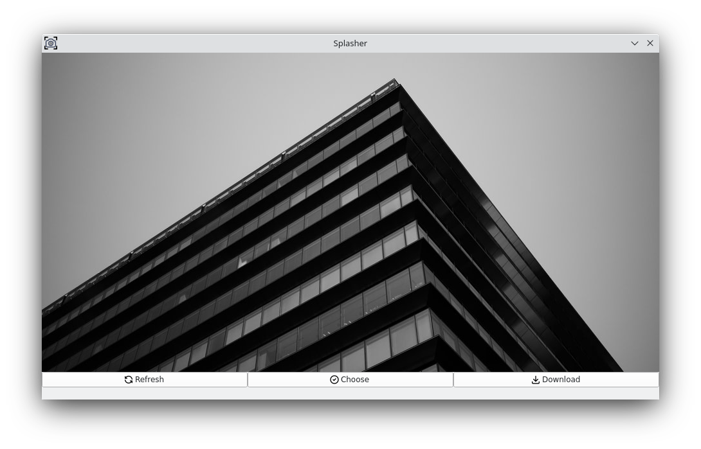

# Splasher

An application that modifies your Linux (GNOME/KDE) desktop wallpaper using images from [Unsplash](https://unsplash.com/).

## Screenshot

## Notice

For people who are using **GNOME**, if the application hints `System tray can not be displayed!`, one possible solution is:

1. Make sure `Tweaks` and `Extensions` are installed.
2. Run command: `sudo apt install gnome-shell-extension-appindicator`
3. Open `Extensions` and select `Ubuntu AppIndicators`

## LICENSE

[GPLv3](https://www.gnu.org/licenses/gpl-3.0.html)
